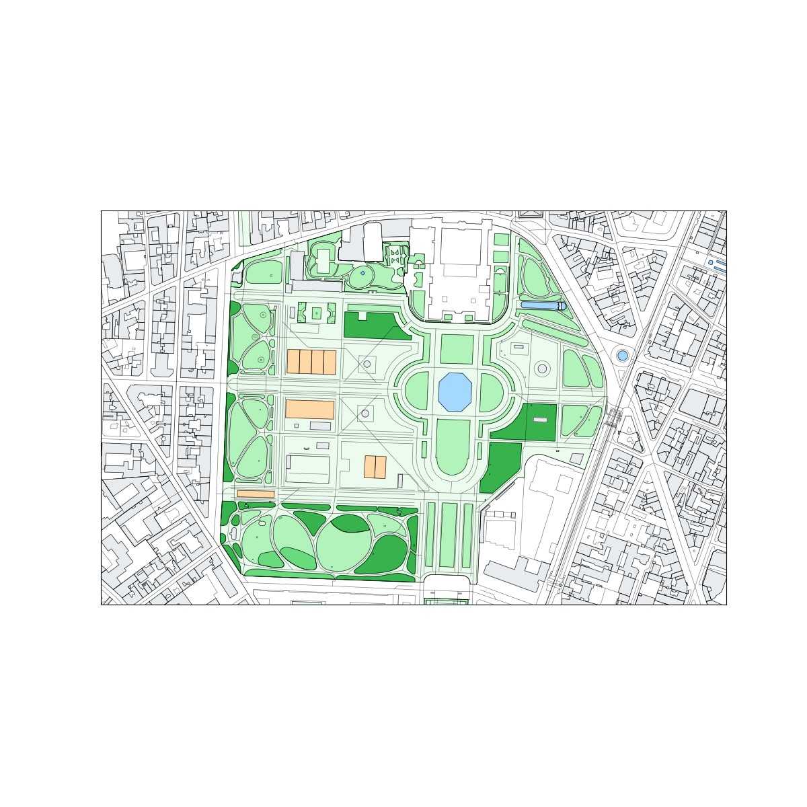
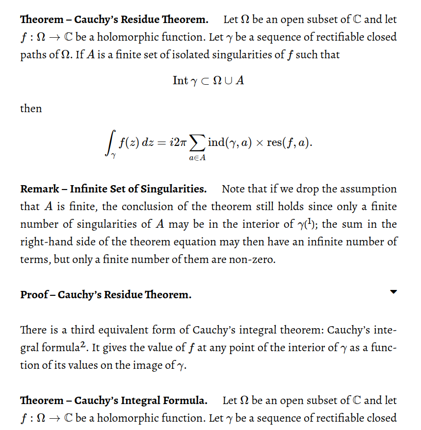
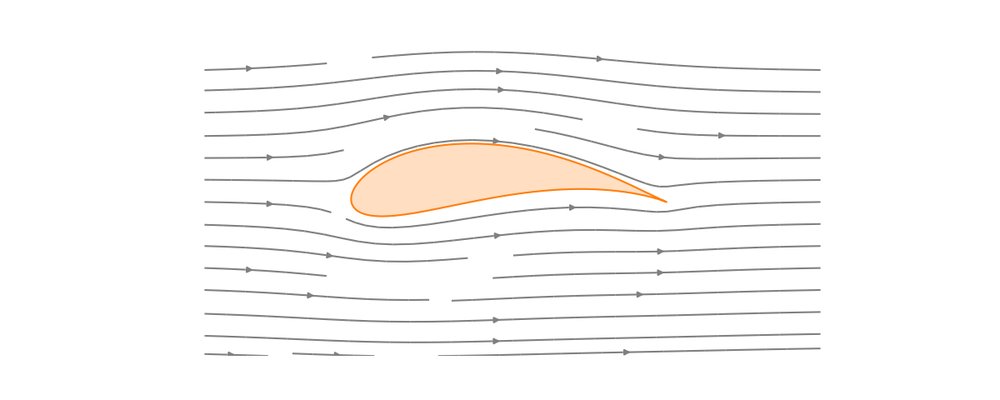
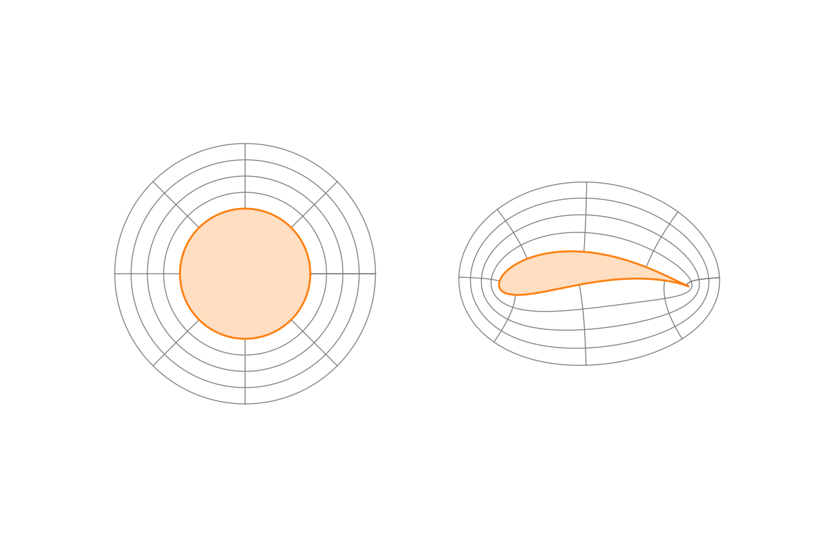
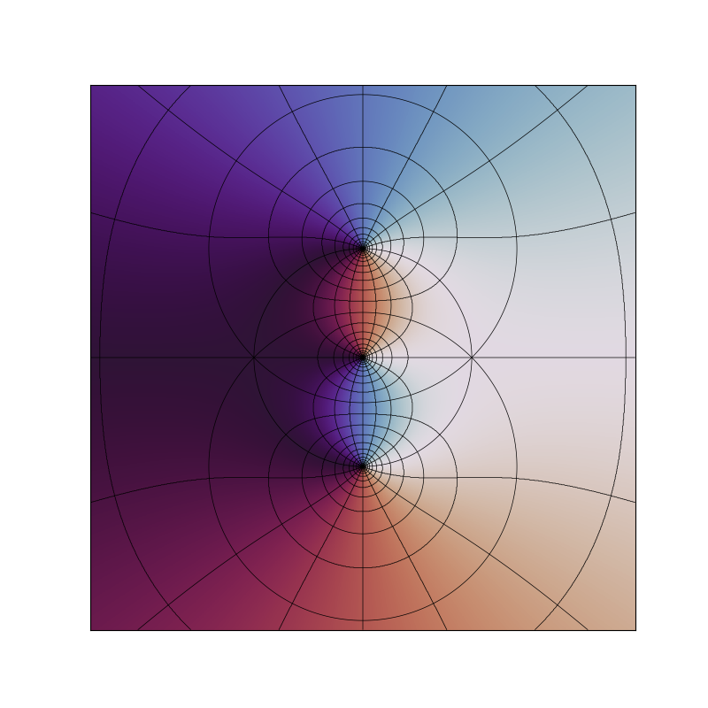

# Jupyter for Education
### Random Bits

Sébastien Boisgérault [✉️](mailto://Sebastien.Boisgerault@minesparis.psl.eu) [🏠](https://eul.ink)
🏦 Mines Paris – PSL

--------------------------------------------------------------------------------

# Python 🇫🇷

Introduction to Programming

Late Undergrad

https://github.com/boisgera/python-fr

--------------------------------------------------------------------------------

# Notebook Pattern #1:
# The Blank Page

--------------------------------------------------------------------------------

  - ⛔ Don't come with your slide deck but ...

  - 🟢 write interactively a Jupyter notebook.

  - 👍 "Rate limiter" and "Priority Filter"

  - 👍 Highly adaptable to the public

  - ⚠️ Beneficial if the students are engaged!

  - ⚠️ Complement with extra ressources

--------------------------------------------------------------------------------

<!-- _color: white -->

# Notebook Pattern 2: 
# Homework

--------------------------------------------------------------------------------

### Example #1 NotebookCeption

A notebook to deal with notebooks!

## 🤯

--------------------------------------------------------------------------------

### Example Task

Implement a `.ipynb` to `.py` (pypercent) converter
    
(a [jupytext](https://github.com/mwouts/jupytext)-like feature)

--------------------------------------------------------------------------------

  - 👍 The notebook object is familiar

  - 👍 But its representation is initially mysterious

  - 👍 Notebook are low-complexity JSON documents

--------------------------------------------------------------------------------

### Example #2 OpenStreetMap

A notebook to:

  - 💽 Get OSM data
  - 🔍 Analyze it
  - 🗺️ Generate a map

--------------------------------------------------------------------------------

  - ℹ️ Embedded doctests (~test-driven)

  - 👍 The map object is familiar

  - 👍 Learn a bit about geographic coordinates

  - 👍 Use folium maps, PIL images & matplotlib

  - 👍 The OSM (XML) data structure is simple

🔗 [GitHub repo](https://github.com/boisgera/OpenStreetMap)

--------------------------------------------------------------------------------

# Calculus

--------------------------------------------------------------------------------

  - [Differential + Integral + Stochastic Calculus](https://github.com/boisgera/CDIS)

  - [**Complex Analysis**](https://direns.mines-paristech.fr/Sites/Complex-analysis/)

--------------------------------------------------------------------------------

## Complex Analysis

A [classic Mathematics course](https://direns.mines-paristech.fr/Sites/Complex-analysis/) with applications:

  - [Poisson Image Editing](https://direns.mines-paristech.fr/Sites/Complex-analysis/Poisson%20Image%20Editing/)

  - [Complex-Step Differentiation](https://direns.mines-paristech.fr/Sites/Complex-analysis/Complex-Step%20Differentiation/)

  - [Signal Processing](https://direns.mines-paristech.fr/Sites/Complex-analysis/Discrete-Time%20Signals%20in%20the%20Frequency%20Domain/)

  - ...

--------------------------------------------------------------------------------

### Joukowky airfoil

--------------------------------------------------------------------------------

--------------------------------------------------------------------------------

<video src="movies/Joukowsky-animation.mp4" type="video/mp4" controls>
</video> 

--------------------------------------------------------------------------------

### Conformal Maps

<video src="movies/conformal-map.mp4" type="video/mp4" controls>
</video> 

--------------------------------------------------------------------------------

### Domain Coloring

- $z\in \mathbb{C} \to f(z) \in \mathbb{C}$

- level curves of $|f(z)|$

- $\angle f(z)$ a hue

📖 [Scientic Visualization](https://github.com/rougier/scientific-visualization-book) 
(N. Rougier, LABRI)

--------------------------------------------------------------------------------

# Control Engineering with Python

🔗 [GitHub](https://github.com/boisgera/control-engineering-with-python)

--------------------------------------------------------------------------------

Theoretical & Experimental introduction to control

Based on the Python scientific stack
    (NumPy + Matplotlib + Scipy + Jupyter + ...)

--------------------------------------------------------------------------------

# Notebook Pattern #3
# Learn to use software tools

--------------------------------------------------------------------------------

### Interactive Notebook Process

  - 👍 Code a snippet of code ...

  - 👍 ... visualize the result ...

  - 👍 document your journey!

--------------------------------------------------------------------------------

### 🧰 Control Engineering Toolbox

  - ODEs solvers: `scipy.integrate`

  - Quiver and stream plots: `matplotlib.pyplot`

  - Pole assignment: `scipy.signal`

  - Optimal control: `scipy.linalg`

--------------------------------------------------------------------------------

# Notebook Pattern #4
# Learn some theory

--------------------------------------------------------------------------------

<video src="movies/locally-attractive.mp4" type="video/mp4" controls>
</video> 

--------------------------------------------------------------------------------

<video src="movies/pathological.mp4" type="video/mp4" controls>
</video> 

--------------------------------------------------------------------------------

<video src="movies/attractive-not-stable.mp4" type="video/mp4" controls>
</video> 

--------------------------------------------------------------------------------

# Notebook Pattern #5
# There is no (need for a) silver bullet

--------------------------------------------------------------------------------

### 🧠 Theory

--------------------------------------------------------------------------------

### 🧪 Experiment

--------------------------------------------------------------------------------

### Documents $\to$ **Multiple Targets**

  - HTML Slide Deck (Reveal.js)

  - Jupyter notebooks

  - PDFs (legacy)

[Pandoc](https://pandoc.org/)-flavored Markdown documents

Transformed with [Pandoc (Python)](https://pypi.org/project/pandoc/). 
